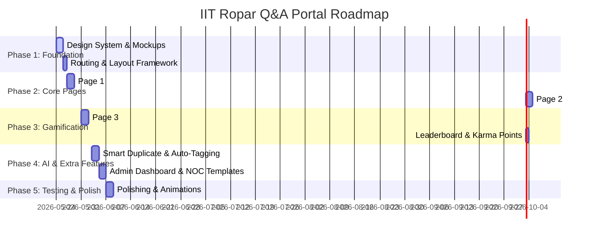

# Project Roadmap & Implementation Plan: IIT Ropar Internship Q&A & FAQ Portal

This document outlines the architecture, roadmap, and core features for building a premium, gamified, and AI-powered Internship FAQ and Q&A Portal for IIT Ropar. Inspired by modern, community-driven platforms (like Samagama's clean structure), it bridges the gap between official administration FAQs and peer-to-peer student support.

---

## User Review Required

Please review the proposed architecture, core features, and AI features before we proceed with the build. 

> [!IMPORTANT]
> **Tech Stack Recommendation:**
> We propose using **Vite + React (SPA)** with a customized **Vanilla CSS Design System** (utilizing CSS variables, CSS grid/flexbox, glassmorphism, and hardware-accelerated animations). This guarantees sub-millisecond page transitions and a highly responsive, modern interface.
> 
> **AI Implementation Plan:**
> To provide instant, responsive recommendations without requiring a complex backend setup immediately, we will build a **smart local AI Engine** using semantic token matching, tf-idf, and rule-based NLP. This allows instant auto-tagging, duplicate detection, and smart suggestions directly in the browser, with clean hooks to swap to a cloud-based LLM (e.g., Gemini API) later.

---

## Complete Project Roadmap



### Phase 1: Foundation & Design System (Days 1-3)
*   Initialize Vite + React project workspace.
*   Configure the CSS variables for colors (IIT Ropar themed: deep blues, academic gold accents, and clean slate greys in light/dark mode), typography, and cards.
*   Establish layout components (Navbar, Footer, Sidebar navigation).

### Phase 2: Page 1 (Posting) & Page 2 (FAQ Hub) (Days 4-7)
*   **Page 1 (Ask & Feed):** Create a dynamic form to ask questions with real-time preview, character counters, and category tags. Build a timeline feed of recently asked questions with sorting (newest, popular, unresolved).
*   **Page 2 (FAQ Hub):** Design responsive accordion drawers categorized by topics:
    *   *NOC Uploads* (Procedures, templates, formats, typical approval delays)
    *   *Stipend Dates & Amounts* (Direct bank transfer dates, monthly timelines)
    *   *Academic Credits* (Credits distribution, supervisor evaluation rules)
    *   *Eligibility & General Queries*
*   Add a fuzzy search system for instant filter-as-you-type search across all FAQs.

### Phase 3: Page 3 (Community Solver) & Gamification (Days 8-10)
*   **Page 3 (Community Solve):** A dedicated board displaying only unresolved/open questions.
*   **Karma Point System:**
    *   *Ask a question:* +5 points.
    *   *Solve a question (Answer):* +25 points.
    *   *Answer marked as "Helpful" / Approved:* +50 points.
*   **Leaderboard:** Highlight top student mentors of the week/month, displaying badges and rankings to incentivize participation.

### Phase 4: AI Engine Integration (Days 11-13)
*   **AI Feature 1: Duplicate Detector:** When a user types a question on Page 1, the AI instantly scans the FAQ dataset and open questions. If a match is found (>75% similarity), it displays a popup: *"Did this answer your question?"* to prevent duplicate submissions.
*   **AI Feature 2: Auto-Tagging Engine:** Analyzes question text to automatically assign tags (e.g., matching "NOC", "dean", or "upload" tags the post as "NOC Upload").
*   **AI Feature 3: Smart AI Auto-Response:** Provides a draft recommendation to community members answering a question, summarizing related FAQ knowledge to help them construct a fast, accurate answer.

### Phase 5: Polish & Deployment (Days 14-15)
*   Implement transitions, loading skeletons, and interactive micro-animations.
*   Add local storage persistence so that all questions, answers, points, and leaderboard ranks persist across browser reloads.

---

## Suggested Additional Features to Add

To make this application feel truly premium, we recommend implementing the following extra features:

1.  **NOC & Document Hub:**
    *   A dashboard component where students can upload, verify, and track the status of their NOC (No Objection Certificate) document.
    *   Include a downloadable document template vault for IIT Ropar official letters.
2.  **Student Profile & Achievements:**
    *   A custom user profile card displaying their current badge (e.g., *"Stipend Guru"*, *"NOC Veteran"*, *"IIT Ropar Scholar"*).
    *   A progress bar showing how many points they need to level up.
3.  **Admin Verification Panel:**
    *   Allows administrator/moderator profiles to mark community answers as "Official" and automatically elevate them to the official Page 2 FAQ page.
4.  **Dark/Light Mode Theme Toggle:**
    *   A glassmorphic theme switch using CSS transitions to offer comfortable viewing in late-night coding sessions.

---

## Proposed Technical Structure

Here is how the repository layout will look:

```
FAQ PROJECT(IIT ROPAR)/
├── index.html
├── package.json
├── src/
│   ├── main.jsx
│   ├── App.jsx
│   ├── index.css
│   ├── components/
│   │   ├── Navbar.jsx
│   │   ├── QuestionCard.jsx
│   │   ├── FAQAccordion.jsx
│   │   ├── Leaderboard.jsx
│   │   └── DocumentTracker.jsx
│   ├── hooks/
│   │   └── useLocalStorage.js
│   ├── services/
│   │   └── aiService.js
│   └── mockData.js
```

### [Component Details]

#### [NEW] [index.css](file:///Users/sam/FAQ%20PROJECT(IIT%20ROPAR)/src/index.css)
*   Establish the premium visual styles: variables, background gradients, custom scrollbars, typography (Inter/Outfit), and glassmorphism styling (`backdrop-filter`, borders, and shadows).

#### [NEW] [aiService.js](file:///Users/sam/FAQ%20PROJECT(IIT%20ROPAR)/src/services/aiService.js)
*   Implements the client-side NLP processor for duplicate detection, auto-tagging, and answering hints.

#### [NEW] [mockData.js](file:///Users/sam/FAQ%20PROJECT(IIT%20ROPAR)/src/mockData.js)
*   Rich set of initial questions, official FAQs (including NOC upload rules, stipend timelines), and mock users for the leaderboard.

---

## Open Questions for the User

> [!IMPORTANT]
> 1. **Tech Stack Approval:** Are you comfortable with **Vite + React** using local storage for data persistence, or would you prefer a backend framework (like Node.js/Express or Firebase)?
> 2. **Design Preference:** Should we use the official IIT Ropar colors (Navy/Deep Blue and Gold) with a futuristic glassmorphic vibe, or do you have another style in mind?
> 3. **Additional Features:** Which of the suggested extra features (NOC status tracker, downloadable templates, Admin panel, profile badges) would you like us to prioritize?
